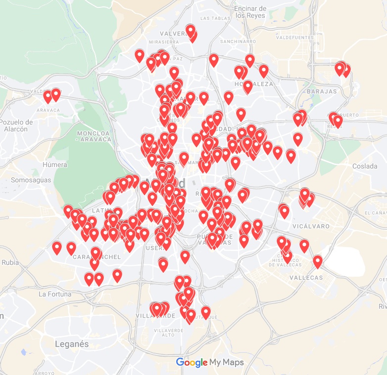

## Observatorio de la evolución de los locales de apuestas en la ciudad de Madrid
En este proyecto voy a analizar la situación actual y las variaciones que se produzcan en el futuro en el número de locales de apuestas en la ciudad de Madrid

La idea para este trabajo surge trás las últimas elecciones municipales de 28 de mayo, en las que uno de los candidatos advertía del peligro de este tipo de establecimientos y su relación con el desarrollo de ludopatía, especialmente en los jóvenes de familias con rentas bajas.

Más en el mismo sentido: Vázquez-Fernández, M. J., & Barrera-Algarín, E. (2020). El juego on-line en España y las apuestas deportivas: Los jóvenes como nuevos perfiles con ludopatía. Health and Addictions/Salud Y Drogas, 20(2), 61–69. [https://doi.org/10.21134/haaj.v20i2.500](https://doi.org/10.21134/haaj.v20i2.500)

### Situación actual
Voy a utilizar como fuente principal el [repositorio de datos abiertos del ayuntamiento](https://datos.madrid.es/portal/site/egob/), que publica mensualmente un censo de locales, alimentado por las licencias de actividad que la institución concede. 

Filtrando por el tipo de licencia y por el estatus de la misma obtenemos que en Junio 2023 hay un total de 374 licencias activas en el municipio para el epígrafe 920002: “JUEGOS DE AZAR Y APUESTAS DE GESTION PRIVADA (BINGOS, CASINOS, MAQUINAS TRAGAPERRAS)”

### Metodología
Durante los próximos cuatro años analizaré la variación de los presentes datos, en qué barrios se centra este fenómeno y si efectivamente hay una relación con la renta.
